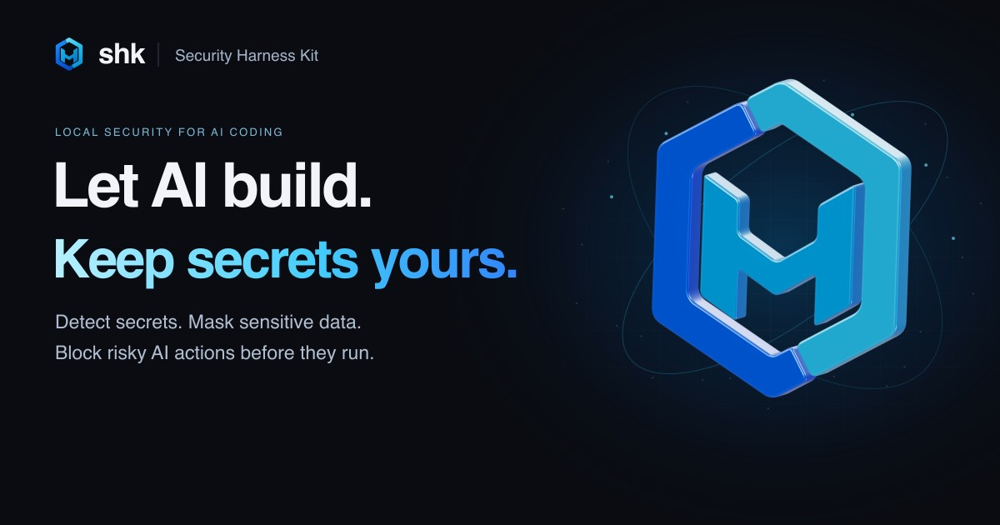

# security-harness-kit (`shk`)



`shk` is a local-first guardrail for AI-assisted development. It helps keep secrets, PII, and risky project surfaces out of AI tool context, Git commits, generated output, and everyday local workflows. It can also encrypt `.env` files and inject decrypted values only when running local commands.

```bash
shk scan .
```

Example output:

```text
3 findings

HIGH  secret.openai_api_key  src/app.ts:12    Possible OpenAI API key detected
MED   pii.ja.phone           config/dev.ts:5  Japanese phone number detected
MED   pii.en.ssn             docs/test.md:8   US Social Security Number detected
```

## Why

AI coding agents can read project files, run commands, and transform sensitive input into new files. `shk` adds local checks around those workflows so teams can audit, mask, or block risky content before it leaves the intended boundary.

With `shk`, you can:

- Scan project paths and Git-staged files for common secrets and PII across source code, Markdown, plain text, Office documents (`.docx`, `.xlsx`, `.pptx`), and text-layer `.pdf` files.
- Mask sensitive content from stdin, text files, and Office documents (`.docx`, `.xlsx`, `.pptx`).
- Encrypt `.env` files, store private keys in the configured secret store, and run commands with decrypted values injected only at runtime.
- Install Git pre-commit hooks.
- Install managed hooks for Claude Code, Cursor, Codex, GitHub Copilot, Antigravity, and Windsurf.
- Preview metadata-only audit logs to understand blocked hook activity without storing detected values.
- Statically audit MCP client configurations for unsafe package, credential, HTTP, and filesystem settings.
- Generate a GitHub Actions workflow that runs `shk scan` on every pull request.
- Diagnose ignore file and `.env` safety coverage.
- Deploy AI agent skills to Claude Code, Codex, Cursor, GitHub Copilot, Antigravity, and Windsurf project directories.
- Use the **shk Desktop** app for local scanning, masking, setup, and audit review with a GUI.

## Desktop App

The **shk Desktop** app (`apps/shk-desktop`) provides a local GUI for project
scanning, AI-oriented masking, setup automation, and audit review. Installers
are published from GitHub Releases; macOS builds are Developer ID signed and
notarized as of `desktop-v0.6.1`.

While it is open it also raises an OS notification when a hook blocks AI
activity in any of your projects.

- Download and install: [Installation → Desktop App](docs/installation.md#desktop-app)
- Notification behaviour: [Blocked-activity notifications](docs/installation.md#blocked-activity-notifications)
- Maintainer release process: [Desktop Release](docs/desktop-release.md)

## Installation

Node.js users can install via npm (the installed command is still `shk`):

```bash
npm install -g security-harness-kit
```

macOS and Linux releases can be installed with the bundled installer:

```bash
curl --proto '=https' --tlsv1.2 -LsSf https://github.com/Kazuki-tam/security-harness-kit/releases/latest/download/shk-cli-installer.sh | sh
```

Windows releases can be installed from PowerShell:

```powershell
powershell -NoProfile -ExecutionPolicy Bypass -Command "irm https://github.com/Kazuki-tam/security-harness-kit/releases/latest/download/shk-cli-installer.ps1 | iex"
```

The `ExecutionPolicy Bypass` flag applies only to that PowerShell process and does not change the user's system policy.
If downloaded PowerShell scripts are managed by your organization and still blocked, use the manual `.zip` install in [Installation](docs/installation.md#manual-windows-zip-install).

macOS and Linux users can also install via Homebrew:

```bash
brew install Kazuki-tam/homebrew-tap/shk
```

See [Installation](docs/installation.md) for npm, release archives, checksums, Homebrew, source builds, and [uninstall](docs/installation.md#uninstall) instructions.

For CI or security-sensitive environments, prefer a pinned release archive with checksum and GitHub artifact attestation verification over installing from `latest`. See [Verified Archive Install](docs/installation.md#verified-archive-install).

## Quick Start

Create a project policy file:

```bash
shk init
```

Scan the current project:

```bash
shk scan .
```

Output a machine-readable report:

```bash
shk scan . --json
```

Mask sensitive content from stdin:

```bash
shk mask < prompt.txt
```

Encrypt a `.env` file and run a command with decrypted values:

```bash
shk env encrypt .env --in-place
shk env run -- npm test
```

Install a Git pre-commit hook:

```bash
shk hooks install
```

Install AI tool hooks in audit mode:

```bash
shk hooks install-ai --audit
```

Install AI tool hooks that still block but keep metadata-only block logs:

```bash
shk hooks install-ai --log-blocked
shk audit
```

Generate a GitHub Actions workflow that scans every pull request:

```bash
shk ci init github
# Add GitHub code scanning alerts and PR annotations:
shk ci init github --upload-sarif
```

Alternatively, use the repository's composite action after checkout on a Linux or macOS runner:

```yaml
permissions:
  contents: read
  security-events: write

steps:
  - uses: actions/checkout@v7
    with:
      persist-credentials: false
  - uses: Kazuki-tam/security-harness-kit@v1
    with:
      path: .
      fail-on: high
      upload-sarif: true
```

Set `upload-sarif: false` when GitHub code scanning is unavailable. Private repositories
need GitHub Code Security enabled to upload SARIF. Pull requests from forks normally receive
a read-only token; disable upload for those runs if the repository does not permit SARIF upload.

Install the shk agent skill for Claude Code, Codex/Cursor, Copilot, Antigravity, and Windsurf:

```bash
shk skills install
```

Check ignore coverage:

```bash
shk doctor ignore
```

## Documentation

- [Installation](docs/installation.md)
- [Commands](docs/commands.md)
- [Configuration](docs/configuration.md)
- [Detection Model](docs/detection-model.md)
- [GitHub Actions Integration](docs/ci.md)

## Common Commands

```bash
shk init
shk init --strict
shk init --yes --no-npm-hardening

shk scan .
shk scan . --json
shk scan . --json --with-value-hash
shk scan . --sarif
shk scan --staged
shk scan . --changed-since origin/main
shk scan --git-history
shk scan --git-history --preview
shk scan --git-history --ref HEAD~50..HEAD
shk allowlist suggest --from report-with-hashes.json --value-hash

shk mask < prompt.txt
shk mask --json < prompt.txt
shk mask report.docx --output report.redacted.docx

shk clipboard scan
shk clipboard mask
shk clipboard mask --write

shk doctor
shk doctor ignore --fix
shk doctor env --dotenvx
shk doctor workflows --fix

shk audit
shk audit --reason action-guard
shk audit --since 7d --tool cursor
shk audit --json

shk mcp audit
shk mcp audit --json
shk mcp audit --sarif
shk mcp audit --global

shk env dotenvx import-keys .env.keys
shk env encrypt .env --in-place
shk env run -- npm test
shk env key import
shk env key list
shk env key delete --env staging
shk env key export --instructions
shk env key migrate --to 1password
shk env decrypt .env --output .env.local

shk hooks install
shk hooks install-ai --dry-run
shk hooks install-ai --audit
shk hooks install-ai --log-blocked
shk hooks install-ai --tool copilot
shk hooks install-ai --tool antigravity
shk hooks install-ai --tool windsurf

shk ci init github
shk ci init github --upload-sarif
shk ci init github --dry-run
shk ci init github --mode audit
shk ci init github --shk-version v0.6.1

shk skills install
shk skills install --tool claude-code --global
shk skills install --tool windsurf
shk skills status
```

## Configuration

`shk` reads policy from `shk.toml` in the current working directory. Read-only commands can use built-in defaults. Commands that write files or tool configuration require a project policy file. When running from outside the project, pass the global `--project-root <DIR>` flag to resolve the policy and project-relative paths from that directory.

Create the default policy:

```bash
shk init
```

Create a stricter starter policy:

```bash
shk init --strict
```

When `package.json` is present, `shk init` can also apply package-manager supply-chain hardening such as `ignore-scripts=true`, npm `min-release-age=7`, and equivalent pnpm/Yarn/Bun age gates. Use `--no-npm-hardening` to skip that setup in automated runs.

See [Configuration](docs/configuration.md) for the full `shk.toml` reference, custom rules, and suppression options.

### Env secret store backends

By default, `shk env` stores dotenv private keys in the **OS keyring** (local, zero extra dependencies). Teams can opt in to **1Password** for shared vault distribution, centralized revocation, and Business audit logs:

> **Prerequisite:** The 1Password backend requires the [1Password CLI (`op`)](https://www.1password.dev/cli/get-started), version 2.24.0 or later. Install it, connect it to the 1Password app or sign in, then verify it with `op --version` and `op whoami` before enabling this backend. The default keyring backend does not require `op`.

```toml
# Keep secret_store = "keyring" until after `shk env key migrate --to 1password`.
[env]
secret_store = "keyring"
project_id = "acme/backend-api"   # required for 1Password; machine-independent

[env.onepassword]
vault = "shk-project-keys"        # required before migrating to 1Password
```

Set `SHK_OP_PATH` to an absolute path when the `op` binary is not on PATH. Run `shk doctor env` to verify `op` resolution, version, and sign-in state.

See [Configuration — Env Secret Store](docs/configuration.md#env-secret-store) and [Commands — env key migrate](docs/commands.md#shk-env-key-migrate) for the full reference.

```bash
# Phase 0 team handoff (no backend change): export instructions → vault → import
shk env key export --instructions
shk env key import --stdin

# Migrate keyring keys to 1Password (copies keys and updates shk.toml)
# Migrates indexed keys plus keys referenced by .env / .env.keys files throughout the project tree.
shk env key migrate --to 1password
# Verify the destination, then delete source copies explicitly.
```

**Threat model (honest):** 1Password is primarily a **team operations** upgrade (distribution, offboarding, audit). It also avoids persisting keys in the local keyring. Desktop app authorization can persist for a CLI session, so it is not a guarantee of biometric approval on every `shk env run`. Prefer short vault auto-lock and 1Password Business access logs for visibility.

## Exit Codes

| Code | Meaning |
|------|---------|
| `0` | No findings at or above the active threshold, or command completed successfully. |
| `1` | Scan or MCP audit findings met or exceeded the active threshold. |
| `2` | Blocking AI pre-hook triggered, or a scan/MCP audit runtime or configuration error occurred. |

## Safety Notes

- Scans and masking run locally.
- Document scanning extracts text from Office documents and text-layer PDFs. Image-only PDFs require OCR outside `shk`; when no text can be extracted, scan reports an informational skip finding.
- Office document masking writes a new `.docx`, `.xlsx`, or `.pptx` file and requires `--output`.
- `shk scan --git-history` scans committed blobs reachable from Git refs. Use `--preview` to inspect candidate counts before a broad history scan, and `--ref`, `--since`, or `--max-commits` to narrow the scope.
- `shk scan --changed-since <rev>` scans files changed on the current branch relative to a merge base with `<rev>`, which is useful for PR CI.
- Built-in detection is pattern-based and includes hand-tuned `shk` rules plus generated gitleaks-derived `secret.gitleaks.*` rules; use it as an AI/local workflow guardrail, not as a complete replacement for dedicated secret scanning platforms.
- JSON reports use `redacted_value: "[REDACTED]"`; `value_hash` is omitted unless `--with-value-hash` is passed.
- Value hashes are deterministic fingerprints keyed by public rule IDs. Low-entropy values can be recoverable by dictionary attack, so treat reports containing value hashes as sensitive artifacts.
- Hook audit logs contain metadata such as counts, tool name, hook phase, rule IDs, action categories, and display path; they do not store raw matched values, prompt bodies, or command text.
- Use `shk audit` to summarize `.shk/audit.log`; add `--no-paths` when path labels should not be printed.
- Allowlist `value_hash` entries are deterministic fingerprints for suppression, not cryptographic secret storage.
- Post-tool hooks are non-blocking.
- `doctor ignore --fix` appends missing patterns to `.gitignore`; it does not remove existing entries.
- `doctor workflows` flags `actions/checkout` steps missing `persist-credentials: false`; `--fix` requires `shk.toml` and edits flagged workflows in place.
- `mask --output` requires `shk.toml` and refuses sensitive env files and protected home configuration files.

## Development

```bash
cargo build
cargo test --all
cargo fmt --all
cargo clippy --all-targets --all-features -- -D warnings
```

CI runs on macOS, Linux, and Windows.

## License

MIT. See [LICENSE](LICENSE).
